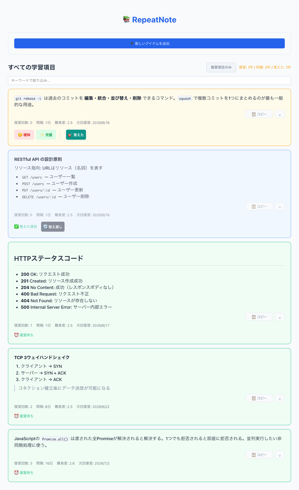

# RepeatNote

[](https://github.com/ifukazoo/repeatnote/actions/workflows/ci.yml)

SM-2アルゴリズムを実装した間隔反復学習アプリ。学習項目をObsidian vaultにMarkdownファイルとして保存し、最適な復習タイミングを自動計算する。



## 主な機能

- SM-2アルゴリズムによる復習間隔の自動計算
- 学習項目の作成・編集・削除（最大1000文字、Markdown対応）
- 画像の添付・編集・削除（JPEG / PNG / WebP / GIF、5MB以内）
- 品質評価による復習（😵 忘れた / 🤔 曖昧 / 💡 思い出した / ✨ 完璧）
- マスター機能（復習サイクルから除外）
- キーワード検索・復習が必要な項目のみ表示
- Claude Desktop から MCP 経由でアイテムを追加

## 技術スタック

| カテゴリ | 技術 |
|---------|------|
| フロントエンド | React 19, TypeScript, Vite |
| API サーバー | Hono, Node.js |
| バリデーション | Zod |
| データストレージ | Obsidian Local REST API（Markdown ファイル） |
| デバイス同期 | Cloudflare R2（Obsidian プラグイン経由） |
| テスト | Vitest, React Testing Library |
| AI 連携 | MCP サーバー（Claude Desktop） |

## アーキテクチャ

```
┌─────────────────────┐     ┌──────────────────────┐     ┌──────────────────────────┐     ┌────────────┐
│  ブラウザ            │     │                      │     │                          │     │            │
│  React + Vite       │────▶│  Hono API Server     │────▶│  Obsidian Local REST API │────▶│  Vault     │
│                     │     │  :3001               │     │  :27123                  │     │  *.md      │
├─────────────────────┤     │                      │     │                          │     │            │
│  Claude Desktop     │     │  - SM-2 アルゴリズム  │     └──────────────────────────┘     └─────┬──────┘
│  MCP サーバー        │────▶│  - CRUD ルート        │                                           │
└─────────────────────┘     │  - 画像プロキシ       │                                    R2 バックアップ
                            │  - 静的ファイル配信    │                                     プラグイン
                            └──────────────────────┘                                           │
                                                                                        ┌─────▼──────┐
                                                                                        │ Cloudflare  │
                                                                                        │ R2          │
                                                                                        └─────┬──────┘
                                                                                              │
                                                                                        ┌─────▼──────┐
                                                                                        │ Android    │
                                                                                        │ Obsidian   │
                                                                                        └────────────┘
```

- **フロントエンド** (`frontend/`): React + TypeScript + Vite
- **APIサーバー** (`server/`): Hono（Node.js）、SM-2計算・Obsidian連携を担当
- **MCPサーバー** (`mcp/`): Claude Desktop から直接アイテムを追加
- **デバイス同期**: Mac mini ↔ Cloudflare R2 ↔ Android を Obsidian プラグインで自動同期

## ディレクトリ構成

```
repeatnote/
├── frontend/   # React フロントエンド
├── server/     # Hono API サーバー
├── mcp/        # Claude Desktop MCP サーバー
└── scripts/    # データ移行スクリプト
```

## セットアップ

### 前提条件

1. Obsidian に **Local REST API** プラグインをインストール・有効化
2. Obsidian を起動しておく
3. `server/.env` を作成:
   ```
   OBSIDIAN_API_KEY=<Obsidian Local REST API の APIキー>
   ```

### 依存関係のインストール

```bash
cd frontend && npm install
cd server && npm install
```

### 起動

```bash
# APIサーバー起動（port 3001）
cd server && npm start

# ブラウザで http://localhost:3001 にアクセス
```

開発時は Vite HMR を使用可能:

```bash
cd frontend && npm run dev  # port 5173
```

## コマンド一覧

### フロントエンド（`frontend/`）

| コマンド | 内容 |
|---------|------|
| `npm run dev` | Vite 開発サーバー起動（port 5173） |
| `npm run build` | プロダクションビルド |
| `npm run lint` | ESLint 実行 |
| `npm test` | テストをウォッチモードで実行 |
| `npm run test:run` | テストを1回実行 |

### APIサーバー（`server/`）

| コマンド | 内容 |
|---------|------|
| `npm start` | サーバー起動 |
| `npm run dev` | ウォッチモードで起動 |
| `npm run test:run` | テストを1回実行 |

## 自動起動（Mac）

Mac では launchd を使ってログイン時に API サーバーを自動起動できます。`~/Library/LaunchAgents/` に plist ファイルを配置し、`launchctl load` で登録してください。

## ライセンス

[MIT License](LICENSE)
